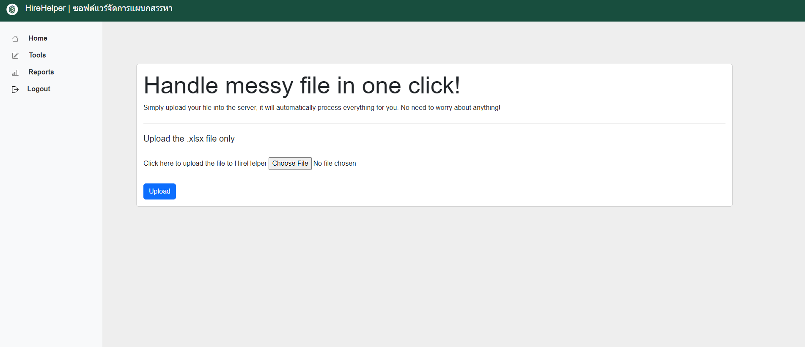

<h3 align="center">HireHelper</h3>
 

ระบบหลังบ้านที่จะช่วยจัดการข้อมูลของทีมงานสรรหาและทรัพยากรบุคคลเพื่อการทำงานที่ง่ายขึ้น

 

## Tools
- Java Spring Boot Framework 
- JDBC (MySQL DBMS)
- Bootstrap
- Normalize.css
- Pandas (Parser and Conversion)
- JavaScript
- Python OCR Service

## Current Work-in-Progress Features 

- Excel Management Module
  - Deal with messy excel file with ease and generate excel pivot table/ graph like never before, just upload and click.
- QR Generator
  - No need to go to Google, just create QR code and download instantly with company logo.

## Future modules:

- PDF OCR Recognition (UTF-8)
- Resume Database (MySQL)
- Dashboard
  - Lead Calculation
  - Turn Rate Calculation
  - Cancellation Rate Calculation
  - Job tracking
  - Facebook API integration
  - Service web scrapper * planned
